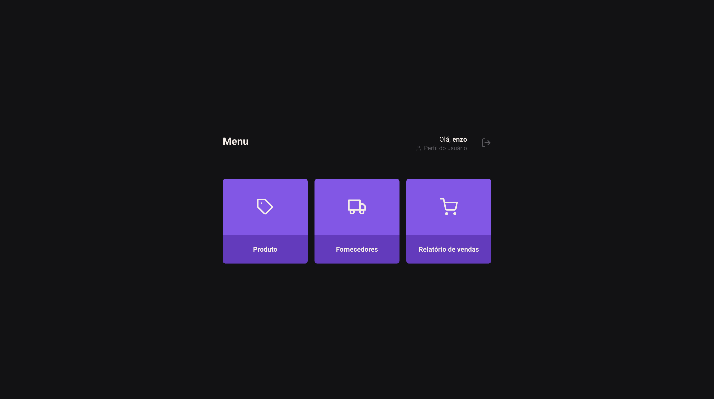

# Explorer-Stock


Explorer-Stock é uma aplicação desenvolvida para gerenciar produtos em um estoque com autenticação e autorização. Utiliza Node.js, Knex, Express e React.

## Protótipo



Você pode acessar o protótipo [aqui](link-do-prototipo-online).

## Índice

- [Descrição](#descrição)
- [Tecnologias Utilizadas](#tecnologias-utilizadas)
- [Instalação](#instalação)
- [API Endpoints](#api-endpoints)

## Descrição

Explorer-Stock é uma solução completa para gestão de estoque, com funcionalidades de autenticação e autorização. A aplicação é dividida em duas partes: backend e frontend.

## Tecnologias Utilizadas

### Backend

- **[Node.js](https://nodejs.org/)** - Ambiente de execução JavaScript.
- **[Express](https://expressjs.com/)** - Framework web rápido e minimalista para Node.js.
- **[Knex.js](http://knexjs.org/)** - SQL query builder para Node.js.

### Frontend

- **[React](https://reactjs.org/)** - Biblioteca JavaScript para construção de interfaces de usuário.

## Instalação

Para clonar e executar este projeto, você precisará do [Git](https://git-scm.com), [Node.js](https://nodejs.org/), [npm](https://www.npmjs.com/) ou [yarn](https://yarnpkg.com/).

### Backend

```bash
# Clone o repositório
git clone https://github.com/seu-usuario/explorer-stock.git

# Entre no diretório do backend
cd explorer-stock/backend

# Instale as dependências
npm install 
# ou
yarn install

# Configure o arquivo .env para suas variáveis de ambiente
cp .env.example .env

# Execute as migrações do banco de dados
npm run knex migrate:latest 
# ou
yarn knex migrate:latest
